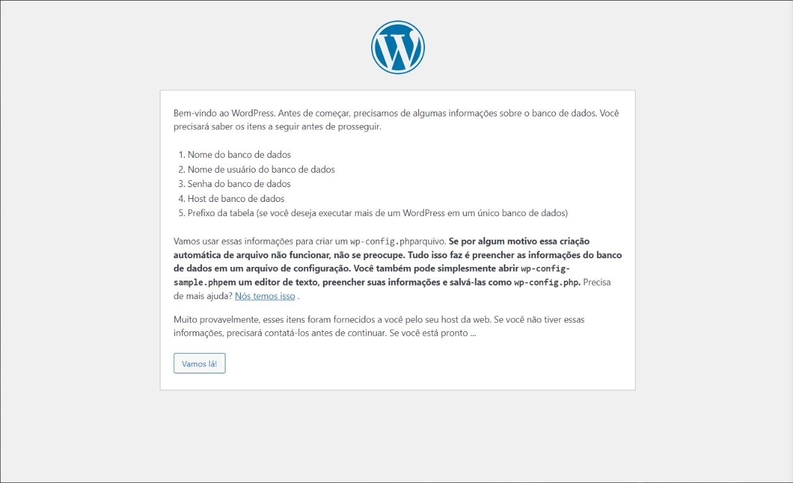

# Como instalar WordPress e o Moodle no Ubunto Server

Esse repositório é um tutorial para auxiliar você instalar WordPress e o Moodle.

## Pré-requisitos

Certifique-se de ter o LAMP(L inux, A pache, M ysql e P HP) instalado em seu computador.

Também certifique-se de estar root no momento da instalação.


Baixe e instale o Unzip para descompactar os pacotes:

```bash
$ apt-get install unzip
```

Baixe e instale o navegador de linha de comando links:

```bash
$ apt-get install links
```

### 1. Instalando o WordPress

Para baixar o WordPress do site oficial digite:

```bash
$ wget https://wordpress.org/latest.zip
```

Após o download ser concluído, o arquivo latest.zip precisa ser descompactado, e para isso digite o seguinte comando:

```bash
$ unzip latest.zip
```

Depois de descompactdo aparecerá uma pasta chamada 'wordpress'. Entre nesta pasta e copie todos os arquivos e cole na pasta `/var/www/html`, para fazer este procedimento digite: 

```bash
$ cp * /var/www/html
```

Em seguida, vamos criar uma database no mysql específica para o WordPress. Para isso entre no banco de dados, com o seguinte comando:

```bash
$ mysql -u root -p
```
E digite sua senha.

Em seguida, vamos criar a database. Para criar a database:

```bash
$ CREATE DATABASE wordpress;
```

Em seguida, vamos configurar o WordPress pela própria interface do CMS. Para isso, digite o `ip` do seu servidor na url do navegador. E se tudo der certo aparecerá essa tela inicial do WordPress.



Depois de clicar em "vamos lá", precisaremos configurar a conexão com o banco de dados. Essa é a hora de utilizar a database anteriormente criada. Neste caso, não é necessario alterar o host do banco de dados e o prefixo da tabela.


Por fim, vamo configurar o nome do blog, o nome de usuário, senha e um email. Logo após isso, o blog estará em produção.


Resultado:


### 2. Instalando o Moodle

Para baixar o Moodle você deve utilizar o navegador de linha de comando:

```bash
$ links www.moodle.org
```
Navegue até a aba de downloads e faça o download do arquivo.

Após concluir o download, utilize o comando `unzip` para descompactar. No caso eu fiz download da versão `3.10`, confira a linha de comando:

```bash
$ unzip unzip moodle-latest-310.zip
```

Em seguida, adicione a pasta `moodle` no grupo `www-data`

```bash
$ sudo chwon sudo chown -R www-data ../moodle
```

Crie também uma pasta para os dados fora da pasta `moodle`

```bash
$ sudo mkdir moodledata
```
Adicione ela também ao grupo `www-data`

```bash
$ sudo chwon sudo chown -R www-data ../moodledata
```

Em seguida, vamos configurar o Moodle pela própria interface do AVA. Para isso, digite o `ip` do seu servidor na url do navegador. E se tudo der certo aparecerá essa tela inicial do Moodle.


Instale a dependência que faltar, no meu caso faltou as seguintes dependências:

```bash
$ sudo apt-get install php-intl php-soap php-xmlrpc
```

Precisa reiniciar o apache. Digite o seguinte comando para reiniciar o apache:
```bash
$ sudo systemctl restart apache2
```
Clique em continuar.

Logo após aparece uma tela de instalação, mostrando todo o que foi instalado.


Por fim, você vai registrar uma senha, login e o nome do site. Resultando na conclusão da instalação do AVA


